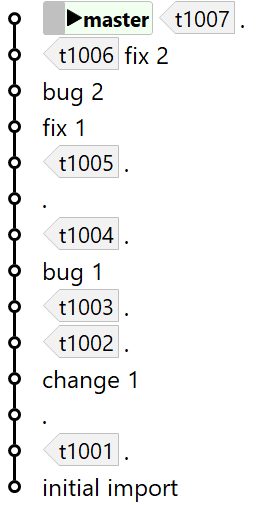
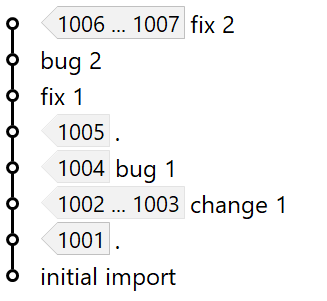
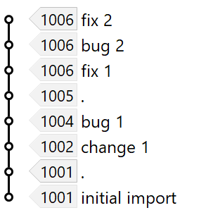
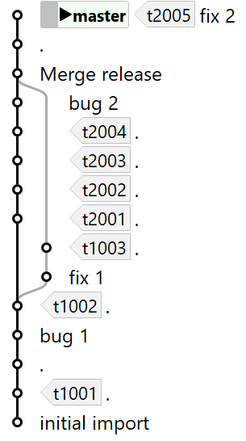
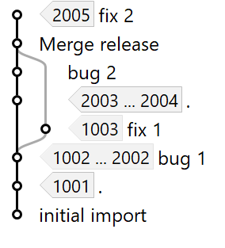
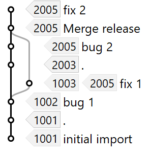

# At Refs vs. On Refs

If *Tag-Grouping* has been properly configured (**View|Tag-Grouping**) the **Navigation** graph will display matching refs.
The way how these refs will be mapped to the file's commits can be controlled by **View|Show At Refs** vs. **View|Show On Refs**.
For simplicitly, let's assume that the *Tag-Grouping* has been configured for tags "t...", which would mean a configuration like `refs/tags/t(?<name>.*)`.

With **View|Show At Refs** selected, every commit will show up those (ranges of) tags which contain exactly the state of the file represented by this commit.
One commit may represent the state of multiple tags and another commit may represent the state of no tag (because for every tag there is a more recent commit for this file).
The same tag will show up only once in the graph, either explicitly or as part of a range.

With **View|Show On Refs** selected, the logic is different: every commit will show up the closest tag in which it is contained.
In this way, every commit will get assigned to at most one tag (usually it's one tag; it would be no tag only if the commit is more recent than any tag).
The same tag may show up multiple times for different commits.

Depending on the question you want to answer, one of these options is usually more useful than the other:

#### Example
> Following graph illustrates a simple linear history with release tags starting at `t1001`:
>
> 
>
> **Show At Refs** will give following graph:
>
> 
>
> This may be useful to answer following questions:
> * Which releases contain the file state `change 1`? Release `t1002` and `t1003`.
> * Which releases contain the bug exactly as present in state `bug 1`? Release `t1004`. Note, that subsequent releases, like `t1005` contain a different file state, but the bug is most likely still present.
> * Do we have any release with `bug 2`? Fortunately not, because `t1005` does not yet contain the bug and `t1006` already contains the fix `fix 2` for this bug.
>
> **Show On Refs** will give following graph:
>
> 
>
> This may be useful to answer following questions:
> * What's the first release for which `bug 1` was introduced? Release `t1004`.
> * And what's the first release for which this bug was fixed, i.e. we have `fix 1`? Release `t1006`.

#### Example
> Following graph illustrates a more elaborate history with a main line (currently `t200x`) and a concurrent release branch (`t100x`):
>
> 
>
> **Show At Refs** will give following graph:
>
> 
>
> This may be useful to answer following questions:
> * Do we have releases containing `bug 1`? Definitely: `t1002` in our release branch and up to `t2002` in our main branch.
> * Do we have releases containing `bug 2`? Fortunately, no.
>
> **Show On Refs** will give following graph:
>
> 
>
> This may be useful to answer following questions:
> * What are the first releases containing `fix 1` for `bug 1`? Release `t1003` in our release branch and `t2005` in our main branch.