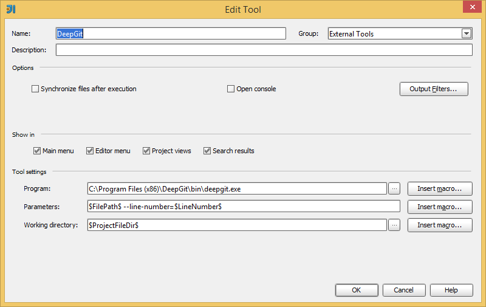
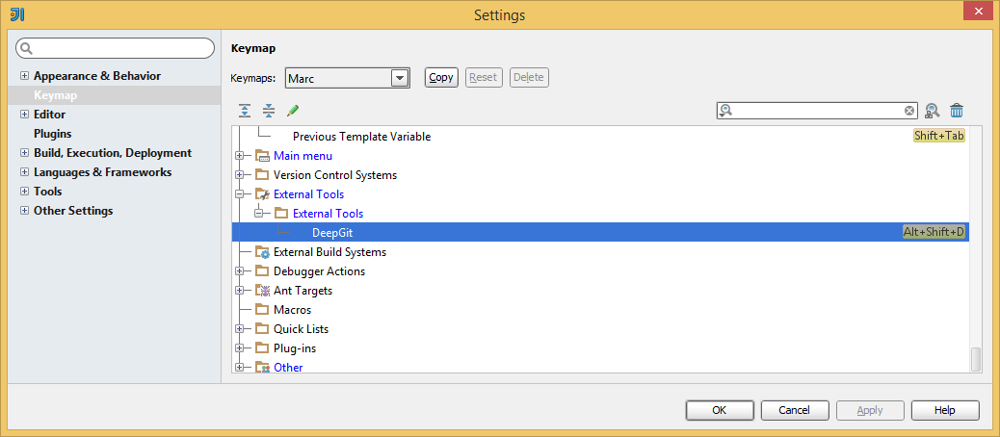
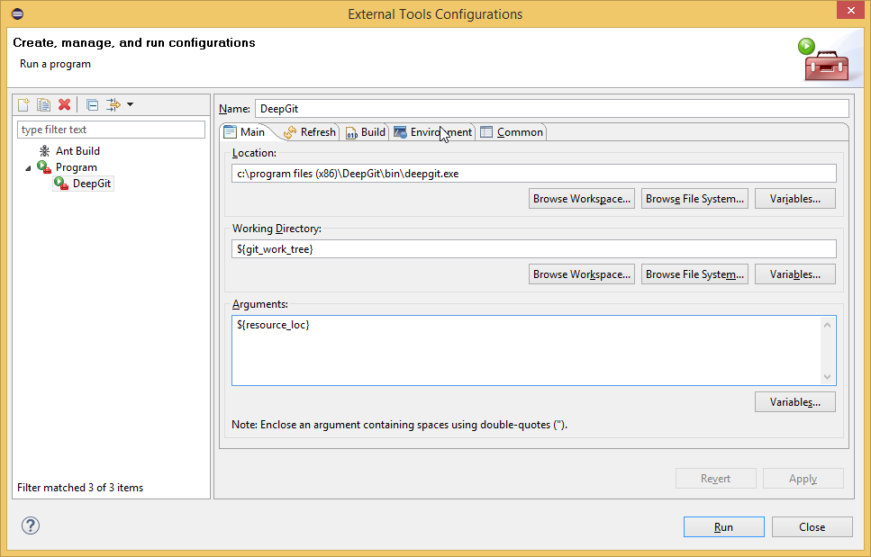
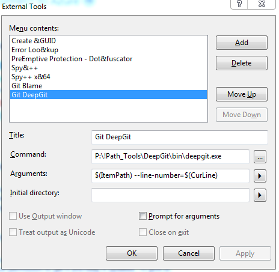

# Integrations

# IDEA integration

To invoke DeepGit from within [IntelliJ IDEA](https://www.jetbrains.com/idea/), open the **Preferences**, go
to **Tools\|External Tools** and create a new tool there:

-   Parameters: `$FilePath$ --line-number=$LineNumber$`
-   Working directory: `$ProjectFileDir$`

An example configuration for Windows might look like:



Finally, confirm with **OK**. Now you can invoke DeepGit using
**Tools\|External Tools\|DeepGit**. To assign a shortcut to quickly
invoke DeepGit, open the **Preferences**, go to **KeyMap** and configure
the shortcut for **External Tools\|External Tools\|DeepGit**. For
instance, you might want to assign `Alt+Shift+D`:



# Eclipse integration

To invoke DeepGit from within [Eclipse](https://www.eclipse.org/),
invoke **Run\|External Tools\|External Tools Configuration** and create
a new configuration there:

-   Working directory: `${git_work_tree}`
-   Parameters: `${resource_loc}`

An example configuration for Windows might look like:



Now you will be able to invoke DeepGit using **Run\|External
Tools\|DeepGit**.

# Microsoft Visual Studio integration

To invoke DeepGit from within [Microsoft Visual Studio](https://www.visualstudio.com/), invoke **Tools\|External
Tools...** and create a new configuration there:

-   Arguments: `$(ItemPath) --line-number=$(CurLine)`

An example configuration might look like:



Now **Git DeepGit** will be available from the **Tools** menu.


Note that this example is using a *portable* installation of DeepGit
which is located at `P:\!Path_Tools\DeepGit`.


# Sublime integration

You can invoke DeepGit from within
[Sublime](https://www.sublimetext.com/) using a *Plugin*:

-   Locate your Sublime settings directory (in my
    case `C:\Users\marc\AppData\Roaming\Sublime Text 3\Packages`)
-   In sub-directory `packages/user`, create a python file `deepgit.py`
    with following content:


``` py
import sublime, sublime_plugin
from subprocess import Popen

class DeepgitCommand(sublime_plugin.TextCommand):
    def run(self, edit):
        for region in self.view.sel():
            row = self.view.rowcol(self.view.line(region).begin())[0] + 1
            fname = self.view.file_name()
            if fname is not None:
              Popen(["c:/program files (x86)/deepgit/bin/deepgit.exe", fname, "--line-number", str(row)])
```


-   Be sure to use the correct path to the DeepGit executable in the
    last line. On Windows,
    `c:/program files (x86)/deepgit/bin/deepgit.exe` will most likely be
    fine
-   Restart Sublime
-   Open a file from your Git repository
-   Open the Sublime console (**View\|Show Console**)
-   Now you should be able to invoke DeepGit by entering following
    command:


``` py
view.run_command("deepgit")
```


-   If anything is wrong, Sublime should report a reasonable error
    message

To assign a keyboard shortcut for DeepGit (e.g. `Alt+Shift+D`),
open **Preferences\|Key Bindings** and add a new binding, like:


``` java
[
    { "keys": ["alt+shift+d"], "command": "deepgit" }
]
```


