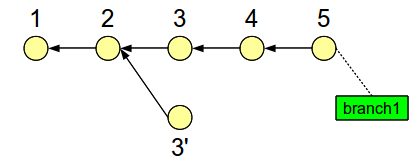
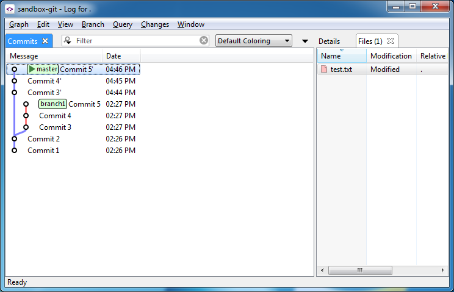

# Modifying the History

This page gives an overview of the various ways in which you can use
SmartGit to modify your repository's history.

#### Warning
>
>
>It is generally a bad idea to modify the *remote* history (i.e. to
>modify commits you have already pushed to remote repositories), since
>this may cause a lot of trouble for other people working in them.
>
>

## Modifying the last commit

The simplest scenario is modifying the contents or the commit message of
the last commit. SmartGit offers the following operations to do this:

-   **Edit Last Commit Message**: You can edit the commit message of the
    last commit via **Local\|Edit Last Commit Message**.
-   **Amend**: When performing a commit (e.g. via **Local\|Commit** or
    by pressing the **Commit** button on the main toolbar), you may
    toggle the option **Amend last commit instead of creating new one**
    on the commit dialog. With this option, the new changes will be
    added to the last commit, instead of being committed as a new
    commit.
-   **Undo Last Commit**: With the menu entry **Local\|Undo Last
    Commit** you can undo the last commit. By doing so, you won't lose
    any changes: The commit's changes will be restored in the Index and
    working tree so you can edit and possibly re-commit them.

If all you want is to edit the commit message of the last commit, **Edit
Last Commit Message** is the simplest way to do it. If you want to alter
the contents of the last commit, you can choose between **Amend** and
**Undo Last Commit**. The former is typically used when you don't need
to know what the exact contents of the last commit are and you just want
to add some smaller changes to it. An example for this is when you want
to fix a typo. On the other hand, if you want to alter the last commit
in a substantial way (or discard it altogether), the **Undo Last
Commit** option is the way to go.

## Merging the last two commits

Merging the last two commits into a single commit is straight-forward:
Undo the last commit with **Local\|Undo Last Commit**, then re-commit
the changes, but with the option **Amend last commit instead of creating
new one** checked on the Commit dialog.

## Splitting the last commit into two

Doing the opposite of merging the last two commits, i.e. splitting the
last commit into two, requires using the Index. SmartGit provides a
specialized editor for it, called the Index Editor. How it is used is
explained in another How-To: [Staging, unstaging and the Index Editor](.md#Staging,unstagingandtheIndexEditor-workflows.index)

In essence, the Index allows you to commit only a subset of the changes
in your working tree, instead of all the changes in it. So, in order to
split the last commit A into two commits A1 and A2, do the following:

-   Undo commit A with **Local\|Undo Last Commit** from the main menu.
-   Use the Index Editor to pick out (i.e. "stage") the changes to be
    included in commit A1. Commit these changes.
-   Commit the remaining changes as commit A2.

## Modifying older commits

If you want to modify commits older than the last one, things get more
complicated. It's not all that difficult though once you understand the
general strategy. Let's take a look at an example: Suppose you have five
commits, numbered 1 through 5, and the goal is to modify just the third
commit, as shown below:

To accomplish this, we need a Git command called *reset*. This command
comes in several flavors that all do slightly different things. In this
case we need *reset hard* and *reset soft*, which have the following
effects:

-   **reset hard**: Moves the current branch pointer to the specified
    commit *and* resets the contents of the Index and of the working
    tree to that commit's contents.
-   **reset soft**: Moves the current branch pointer to the specified
    commit, *but* leaves the contents of the Index and of the working
    tree as they are.

In Git, if you move a branch pointer elsewhere, you risk losing the
commits the branch pointer was pointing at, since the commits might
become unreachable. To prevent this, we'll have to create an additional
branch pointer, in this case named *branch1*, which points at commit 5.

Now here's the trick: After creating *branch1* (without switching to
it), we'll do a hard reset on commit 3, then a soft reset on commit 2.
This is shown below:

The result is that our branch pointer is now at commit 2, but our Index
and working tree contain the changes of commit 3.

In this state we can now alter the contents of the Index and/or working
tree in order to prepare a modified version of the original commit 3.
Then, when we commit these changes, the history will branch off from
commit 2 (since that's where our branch pointer was) to a new, modified
commit 3':

We're almost there. Now we need to somehow move the commits 4 and 5 over
to the newly created branch:

There are two ways to do this, either with cherry-picking or with
rebasing. In both cases, you may need to resolve conflicts between your
new changes made in commit 3' and the changes from commits 4 and 5.
After that, the final step will be to remove *branch1* in order to
discard the original history.

Now that you've seen the general idea, let's see how we can do this with
SmartGit.

-   First, open the repository with SmartGit. Select the repository root
    in the *Repositories* view, then open the Log window, either by
    clicking on the **Log** button on the main toolbar, or by selecting
    **Query\|Log** from the main menu.
-   The first thing to do is to create a new branch on the last commit
    (without switching to the branch) in order to make sure we won't
    lose any commits while performing resets. To create the branch,
    select the last commit, then select **Add Branch** in the commit's
    context menu. On the dialog, enter the branch name and confirm by
    clicking on the **Add Branch** button. This is what the Log might
    look like afterwards:

-   Now, we need to do a hard reset on commit 3, and a soft reset on
    commit 2, in that order. After that, the *master* branch pointer
    will be at commit 2, and the working tree will contain the changes
    from commit 3.
-   You may (but don't have to) alter the contents of the working tree.
    Then stage the changes and commit them in order to create an
    alternate commit 3'.
-   Now we need to put commit 4 and commit 5 on top of commit 3'. There
    are two options here, rebase and cherry-pick.
-   With rebase: Select **Branch\|Rebase** from the main menu. Assuming
    you're still on the branch where commit 3' is, select the option
    **Selected commit to HEAD** and click **Next**. On the following
    dialog, select commit 4 and 5, then confirm the rebase by clicking
    on the **Rebase** button.
-   With cherry-pick: Select **Branch\|Merge** from the main menu. On
    the dialog, select commit 4 and 5. If they aren't shown, click on
    the arrow button on the top right to open a drop-down menu. In this
    menu, select **All branches**. Now select the option **Only the
    selected commits** on the dialog and confirm the operation by
    clicking on the **Merge** button.
-   With both rebase and cherry-pick, you may encounter conflicts: There
    may be conflicts between the changes from commit 3' and the changes
    made in commit 4 and 5. If that happens, SmartGit will stop the
    rebase or cherry-pick and remain in a conflict state. For further
    information on how to proceed here, see: [How to resolve conflicts](How-to-resolve-conflicts.md#Howtoresolveconflicts-workflows.resolve-conflicts)
-   If all went well, the Log might now look like this:

-   Finally, remove *branch1* to discard the old history. There are two
    ways to do this: (1) Select **Branch\|Branch Manager** from the main
    menu, then select *branch1* on the dialog, then click on the
    **Delete** button. (2) Open the Log window (**Query\|Log**), select
    the commit to which *branch1* is attached, select **Delete** from
    the commit's context menu, then follow the dialog instructions.

## Merging and splitting older commits

So far, we've seen how to modify an older commit. A more general problem
is modifying an entire *range* of older commits. For example, how can we
merge the changes from commit 3 and 4 into a single commit? This is
shown below:

For this problem, we can use a more general version of the hard-soft
trick explained above: First, we'll do a hard reset on commit 4, then a
soft reset on commit 2, as shown below:

The result of this operation is twofold:

-   The branch pointer is at commit 2.
-   Our Index and working tree contain the changes that were made in
    commit 3 and 4.

At this point, you can alter the original history in any way you want.
We'll discuss two possibilities, merging and splitting commits.

### Merging commits

If you perform a commit at this point, you'll end up with a new commit
that branches off from commit 2 and contains the combined changes from
commit 3 and 4. This is shown below:

It is also possible to alter the contents of the working tree before
committing. In that case, you'd get a modified version of the combined
changes from commit 3 and 4.

Finally, we need to move commit 5 over to our new, alternate history:

This can be done with cherry-picking or rebasing, as was explained
above.

### Splitting commits

Recall that after the hard and soft reset, the working tree contains the
combined changes from the original commits 3 and 4. That means we can
use the Index Editor to split these combined changes into as many
commits as we want. For example, we could split them up into three
commits, where the last one contains changes from both commit 3 and 4.

In any case, you would commit these "changed changes" one by one, and
then append the remaining commits from the old history, in this case
commit 5, to the altered history with cherry-picking or rebasing.

## Reordering commits

A special case of altering the history is to change the order of
commits. This is a bit simpler than the history modifications described
above. As an example, suppose we have five commits, numbered 1 through
5, and we want to swap commit 3 and commit 4. This can be done as
follows:

-   Put a branch pointer on commit 5 so we won't lose any commits while
    altering the history.
-   Hard reset to commit 2. Effectively, this creates an alternate
    history that branches off from the original history at commit 2.
-   Cherry-pick commit 4.
-   Cherry-pick commit 3.
-   Cherry-pick commit 5.
-   Delete the branch pointer on commit 5 that you created in the first
    step. By doing so, you will discard the old history.

This procedure is illustrated below:

