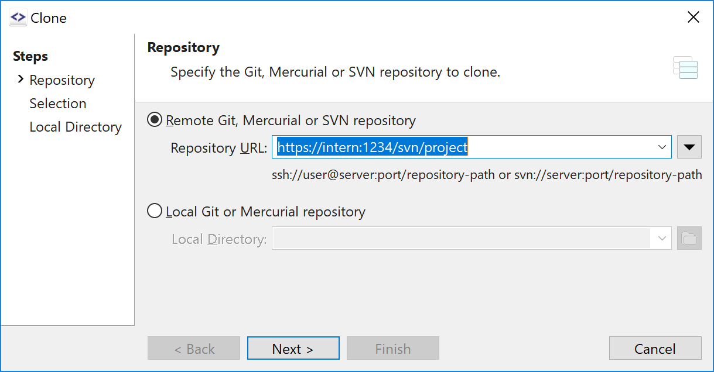
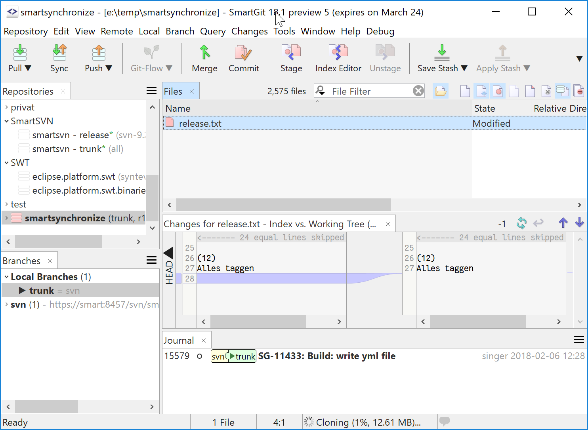
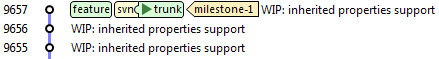

# SmartGit as SVN Bridge

This page provides an introduction to SmartGit from an SVN users
perspective and shows how the most common SVN workflows can be performed
using SmartGit.

## Check Out: cloning an SVN repository

With Git, you do not check out a certain revision, but you **clone** an
entire "repository". For SVN repositories, you will get the complete
version history for the specific URL of your project (either a complete
Subversion repository or a sub-directory of such a repository which
contains your project, including `trunk`-, `branches`- and
`tags`-directory).

This may sound like a huge amount of data, but the initial phase of a
SmartGit clone is as quick as an `svn checkout`. Git is efficient in
storing version history: it's not unusual that a Subversion working copy
(one single revision) and the complete Git clone (of all revisions) are
about the same size.

## Working Copy: the Git working tree

Once the initial phase of Check Out has completed, SmartGit will open
your fully-functional **Git repository** in the project window. The Git
repository consists of a **working tree** and the entire version history
(stored in the `.git`-subdirectory) of your repository.

Similar to SVN, SmartGit provides several commands to alter your working
tree. Most of them are located in the **Local**- and **Branch**-menu.
Read more ...

## Commit (part 1): Commit locally

To commit your changes, use **Local\|Commit**. This is a purely local
operation and will create a *Git commit* in your (local) repository. It
does not yet create any new revision in the SVN repository, nor does it
contact the SVN server at all.

## Log: Git commits and version history

The **Log** window shows the commits of your local Git repository:
commits which are ancestors of *remote branches*, like `svn/trunk`, are
already present in the SVN repository. Commits which are just ancestors
of *local branches*, like `trunk`, are only present in your local Git
repository.

The Log will only be present, once the Check Out has been finished and
**all** revisions have been fetched.

## Commit (part 2): Push

To publish your changes, as `svn commit` does immediately, you have to
*Push* your local commits back to the SVN repository by using
**Remote\|Push** (Project window).

The results of a *Push* show up in the Log window: *remote branches*
become updated to the corresponding *local branches* because the commits
are now present in the SVN repository.

Until you have pushed your commits, you have all freedom to rearrange
them:

## Update: Pulling changes

To fetch the latest revisions of other users to your local Git
repository, use **Remote\|Pull** (Project window).

If you have local commits, you may either **Pull** (and hence *Rebase*)
your changes onto the latest SVN commits, or you may just **Fetch**
these commits and have your *local branch* diverge from the *remote
branch*. In the latter case, you need to Rebase your local commits onto
the latest SVN commits manually.

## Switch: changing the current branch

Contrary to SVN, *branches* and *tags* are native concepts of Git. Read
more ...

SmartGit maps `branches/` and `tags/` directory of your SVN repository
to Git branches and tags accordingly. Read more ...

To switch (`svn switch`) from one branch to another, you may use
**Local\|Check Out** or the **Switch** menu item from the popup menu in
the **Branches** view (Project window).

## Merge (part 1): Merging release branches

Release branches are merged from time to time to the main development
line (usually `trunk`). In SmartGit, use **Branch\|Merge** to perform
such a merge (Project and Log window). This will result in a *merge
commit* which is a core concept of Git. When pushing, it will be
translated back to the SVN `svn:mergeinfo` property.

## Merge (part 2): Rebasing feature branches

When using SVN, maintaining features branches requires merging from the
main development line from time to time and finally performing a
reintegrating merge to get the feature back into the main development
line. With Git there is a more effective mechanism for that, called
"Rebase": Rebase will rewrite your feature branch commits onto the
latest commits of your main code base.

Rebase can be used for locally as well as for remotely managed feature
branches. It will also be used to rewrite your local commits onto the
latest SVN commits when Pulling.

## Copy (WC-URL, URL-URL): creating tags and branches

You can create a new branch or tag simply by using **Branch\|Add
Branch** or **Branch\|Add Tag** on a specific commit (Log window). For
example, branch `feature` and tag `milestone-1`. Read more ...

As for commits, both, branches and tags, are just locally present in
your Git repository after adding them. To create the branch in the SVN
repository as well, use **Remote\|Push** (project window) for the
current branch or **Push** from the **Branches**-view context menu
(Project window) for all other branches. This will result in a new SVN
revision, for which `branches/feature` will be added and marked as
copied from `trunk`. The corresponding Git branch `svn/branches/feature`
shows up in the Log window immediately after the Push:

Local tags do not have a `remote` counterpart in the Git repository.
They can simply be pushed to SVN, either immediately when creating them
(**Add Tag** dialog) or later from the **Branches**-view context menu
(Project window).

