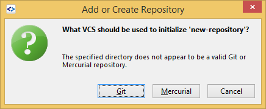
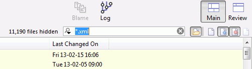
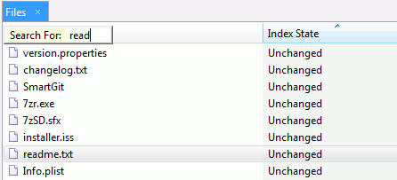
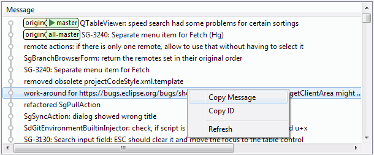
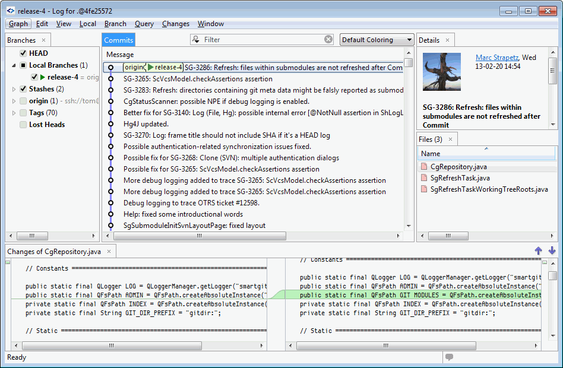

# Tour

 

This page gives an overview of the basic usage of SmartGit. In addition
to explaining the basics, we will focus on those features and
peculiarities of the program that may be difficult to discover for
first-time users. For more comprehensive documentation, please see the
[manual](http://134.119.46.64:8090/doc/Documentation.html).

## Create Repositories

If you have no Git or Mercurial repository available, but want to create
a new local one (just for you), click Repository\|Add or Create.

 

Now enter the directory of the new repository. This either can be an
already existing one, but you also can enter a new one. In the latter
case it will be create automatically.

Clicking OK will check whether the entered directory is already a
repository (contains either a .git or .hg subdirectory). If it is not
already an repository, SmartGit will ask you whether to initialize it.
If both, Git and Mercurial executables, are configured in the
preferences, you will see following choice (otherwise a simpler
confirmation dialog):

Now you've created a new Git or Mercurial repository. You can add files
(outside SmartGit) to the entered directory and later commit those in
SmartGit.

You also can use these steps to add already existing repositories to
SmartGit. Just enter their path as for the new repository. An
alternative to open an existing repository is to drag it from your file
manager into SmartGit's Repositories view.

## Repositories

To open a repository, either double-click it, select one or more,
right-click and select Open. To open a repository in a new window,
right-click it and select Open in New Window.

Each repository can have a name for better description. To change that,
right-click the repository and select Rename.

If you have a large number of repositories, you may organize belonging
repositories into groups. Just create a group using Repository\|Add
Group and drag and drop the repositories into this group.

## User Interface

After opening a repository, SmartGit reads its directory structure.
Expanding the repository node will show this directory structure. The
selection in the Repositories view determines what is shown in the Files
view. Use the small toolbar buttons above the Files view (or the View
menu) to **filter the shown files** by their state, e.g. untracked or
unmodified files. To filter by name, use the File Filter input field.

 

By default, files are listed recursively, so not only files from the
selected directory, but also from *subdirectories* are shown.
Directories marked as 'ignored' will not be scanned and hence the files
in them will not be shown. New ("untracked"), modified or deleted
("missing") files will show up with special icons on the Files view. In
the Directories view **red arrows indicate where committable files are
located** inside the directory structure. If committable (e.g.
untracked) files are hidden because of filtering, the file table will
show a light pink background to remind you about the filtering, so you
won't forget to commit them. If untracked files you don't want to commit
filling up your repository, consider to ignore them (Local\|Ignore).

To **quickly select a file**, simply start typing its name. As for the
filtering, you may use [glob pattern](http://en.wikipedia.org/wiki/Glob_(programming)). Use the up
and down cursor keys to select the next or preview matching file. This
feature is also available in other parts of SmartGit.

You can use drag and drop to rearrange the layout of the views. There
are two layouts, Main and Review, independent from each other
configurable. To hide a view, click the small cross button in its title.
To **restore a closed or activate a view**, use the corresponding menu
item from the Window menu.

## Review Local Changes

 

SmartGit offers different ways to review local changes:

-   The Changes view shows the changes of the selected file. Use the
    small arrow buttons in its toolbar to navigate from change to change
    over all shown committable (text) files.
-   To open an **editable Compare** window click the Changes toolbar
    button or double-click a file in the Commit dialog.
-   To commit only *parts* of modified files, use the Index Editor for
    that file. This allows to **freely edit the file's Git Index
    content** as well as the working tree content. The Git Index content
    can be committed with the next commit independent of the working
    tree content.

## Commit

Window\|Commit Message will show a view to **prepare the commit
message** while reviewing local changes. When invoking the Commit
command, this prepared message will be used to prefill the occurring
commit dialog. The initial file selection on the commit dialog depends
on your current selection on the main window. For example, if you select
the root directory of your repository before opening the commit dialog,
*all* changed files in the repository will be selected for committing.
If you select a particular changed file on the Files view, only this
file will be selected for the commit. To commit staged changes, either
select a file with index changes or select the root directory before
invoking the Commit button.

To **ease entering of file names** in the Commit dialog, use Ctrl+Space
shortcut to get a list of all files selected for the commit.

To reuse the message of an existing commit, click the Select from Log
button. As for all Logs (e.g. Merge, Cherry-Pick, too), **right-click to
copy the commit ID** (or message).

## Local Changes

For those cases where an error does make it through the review phase and
ends up being committed, SmartGit provides several options in addition
to the standard Git procedures to fix commits:

-   You can **undo the last commit** by selecting Local\|Undo Last
    Commit. This will restore the committed changes in the Index.
-   You can "add" further changes to the previous commit by marking the
    Amend option on the commit dialog.
-   To **change the previous commit's message** (even if there are local
    changes), use Local\|Edit Last Commit Message.

See [this manual section](Local-Operations-on-the-Working-Tree.md) for
further information.

## History

To **show the commit history**, select the repository root (for the
entire history), file or directory and click the Log button from the
main toolbar.

In the Branches view, select the checkboxes before the branches, tags or
stashes you are interested in. Their commit history structure then will
be displayed in the Commits view. When selecting a checkbox before a
category, e.g. Local Branches, *all* items will be shown, otherwise only
the selected ones - even if you create new items. **Double-click a local
branch to switch**. Double-click a remote branch to create a
corresponding local branch. The Lost Heads will show all commit heads
which are not accessible from a tag or branch.

Tracking and tracked branches will be shown as **jigsaw pieces**. If
both are pointing at the same commit, the jigsaw pieces are shown
connected.

The Files view shows all changed files of the selected commit. If **two
commits are selected**, the **difference between both commits** will be
shown. Select a file entry to see its detailed changes in the Changes
view. By right-clicking a file you can **save the file state to disk**
or compare it with a file on your disk defaulting to the matching one in
the working tree.

## Pulling and Pushing

SmartGit has various ways to pulling from or pushing to remote
repositories. The most obvious are the Pull and Push toolbar buttons.
Because pushing often might fail because of remote changes, Sync first
pushes and then pulls, so it is a clever alternative to using Push
followed by Pull. For more information about these operations, see [this manual section](Synchronizing-with-Remote-Repositories.md).

If you don't want to push all local commits, use the context menu of the
Pushable Commits view.

To push certains tags or branches, use the context menu of the Branches
view.

