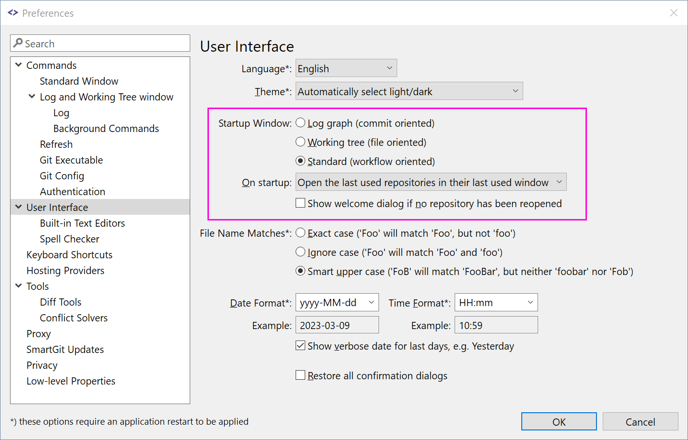

# Main Windows

SmartGit comes with 3 different main windows that all can execute Git commands:

- the [Working Tree window](#Working-tree-window) focuses on a file-centric display of changes; it also shows the **Journal**, a tiny log for the latest commits of the current branch and from another branch (e.g. for cherry-picking),
- the [Log window](#Log-window) focuses on the commit graph history; local changes are displayed as a separate node attached to the HEAD;
- the [Standard window](#Standard-window) focuses on easier (more limited) work-flows; it combines a file-centric **Local Files** and a graph-based **History** view of the repository

There are two ways to specify which window to prefer.
You can decide during the Setup wizard:

or later using the Preferences:

You can use all 3 different main windows at the same time, but the default one you can configure in the preferences.
The default window is used, e.g. if you open a repository using the command line.

### Rearrange views

For the Working Tree and Log windows you can rearrange the views by dragging their titles.
To place multiple views into one tab group, drag them onto the center of another view.
To restore the default layout, use **Window\|Reset Perspective**.
Each of these windows can remember two different layouts (called *perspectives*).
You can switch between them using **Window\|Main Perspective** and **Windows\|Review Perspective**.

## Working Tree window

The Working Tree window focuses on the (changed) files of your working tree.
Selecting a file will show its changes in the Changes view.

The *Journal view* shows the latest commits of the current branch and one optional other branch (e.g. to cherry pick commits from).
To see the full history of the repository, you need to open the [Log window](#Log-window).

## Log window

The Log window focuses on the commits of your repository, but also allows to operate on local changes with the help of the **Working Tree/Index** node.

If a commit is selected, the *Files view* shows the files from the commit.
Selecting a file will show its committed changes in the *Changes view*.

If the **Working Tree/Index** node is selected, the *Files view* shows the files from the index and working tree.
Selecting a file will show its index or working tree changes.

Use the checkboxes in front of the items in the *Branches view* to select what is shown in the *Graph view*.
The *Recyclable Commits* checkbox will cause all commits to be shown which are not accessible from a branch or tag (any more).
This can be very useful to get access to "lost" commits.

## Standard window

The Standard window focuses on simpler work-flows.

The left most *Local Files* and *History* toolbar buttons let you switch between showing working tree and index files, and the history graph.
